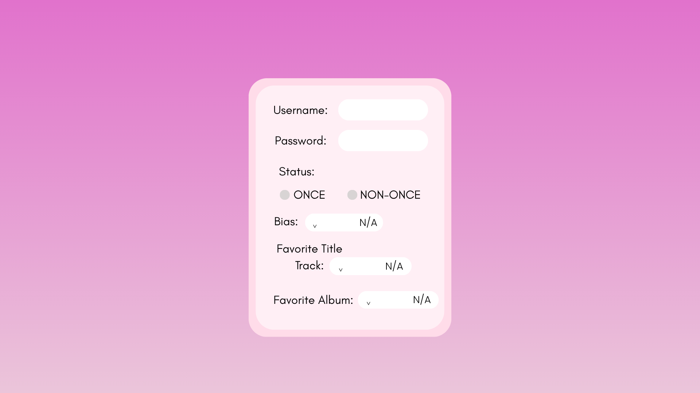
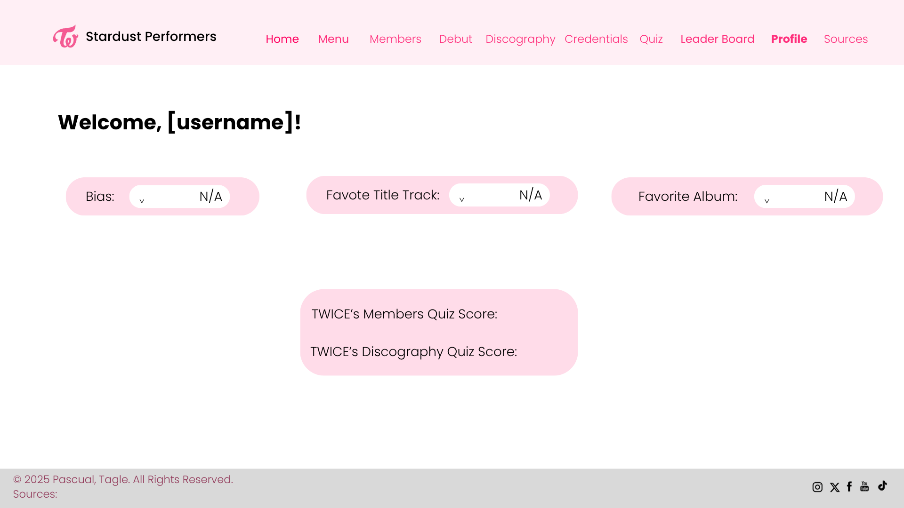
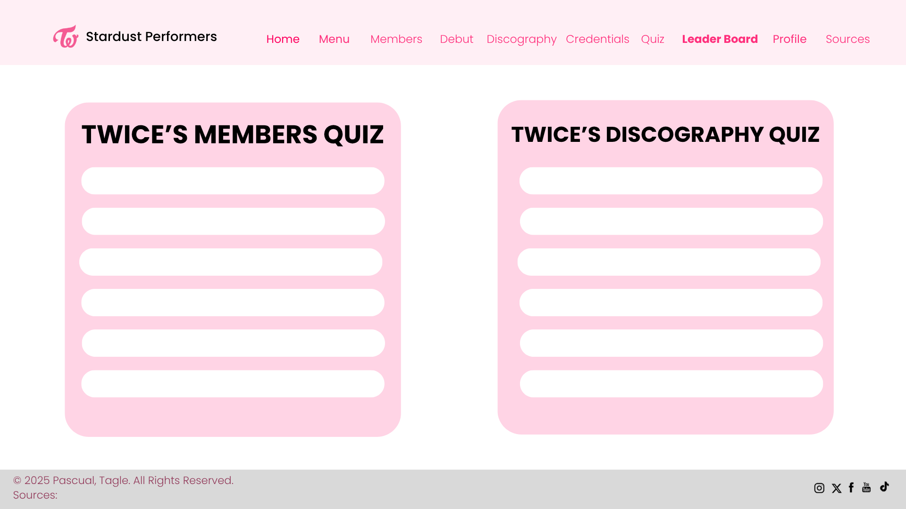
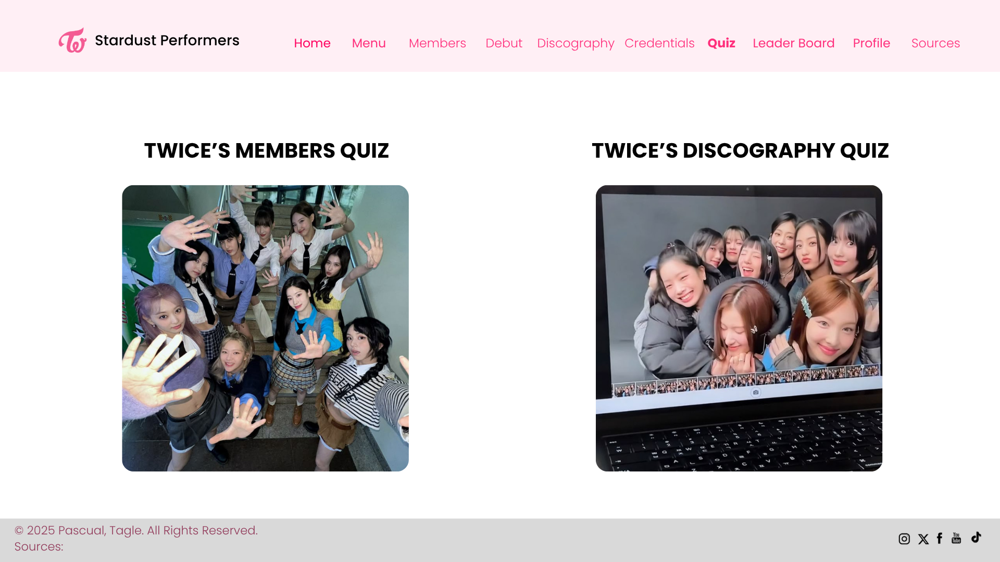
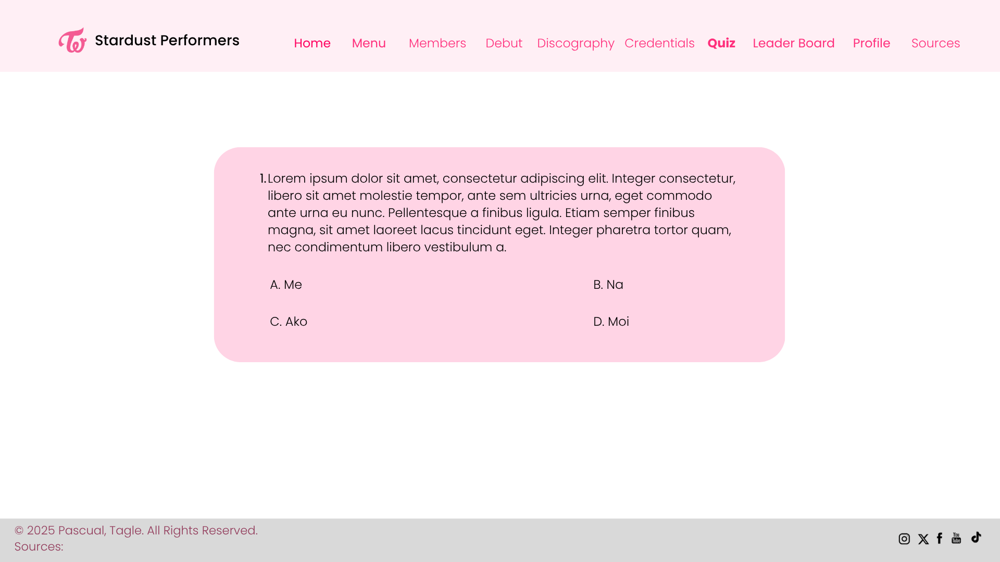

# **FINAL MODIFICATION PROPOSAL**

## Stardust Performers
This project is for users who are getting into TWICE. Our main target are non-ONCEs, and we believe that the website is a perfect introduction for them. ONCEs are of course not exempted, Stardust Performers will be refreshing for them and will gain nostalgia from the time they started gaining interest for TWICE. This website is also a tribute to the girl group’s ten year anniversary, a huge milestone for them and the industry, continuously breaking boundaries.

Users will love this project because they will get to listen to snippets of the title tracks per album and will get to answer mini quizzes about TWICE. By providing fans with a way to discover TWICE's music through curated content such as sample tracks from their albums, users are able to navigate the music more efficiently and easily than before. Additionally, through mini quizzes, the users are encouraged to interact with other fans and have fun while providing them with an entertaining experience. This site will be both educational and enjoyable at the same time.

User data stored in localStorage includes account information, mini quiz scores, performance history, and preferences the user has like their favorite member, favorite song, and favorite album. Therefore, when you refresh your browser or return to the TWICE website, your information will remain the same and you will have a consistent, seamless experience from visit to visit.

## Mini Quiz Feature:
The mini quiz feature will serve as a test of users’ knowledge after exploring our website. Each of the mini quizzes consist of questions about TWICE members and information about their songs, albums, or accomplishments. This information gathered from the mini quizzes will help provide encouragement for users to continue learning about TWICE through our website. 

Once a user has completed a mini quiz, their score will be saved in localStorage and used to rank that user on a leaderboard where they can be ranked against other users. This will give the user another reason to come back to our site. 

## Leaderboard Feature:
The leaderboard displays how users rank for each mini quiz based on their score. The score that is displayed on the leaderboard will be reflected anytime the user takes the quiz again. The leaderboard is constantly being updated to display changes in ranking due to new scores recorded from localStorage data.

# Implementation of CRUD:
### Create (C): 
Users create an account for our website by signing up through submitting forms. Once the form is submitted, the information supplied in the form by the user will be saved as user data in localStorage.

### Read (R):
Users will be able to view their profile and all saved information about them. Their profile displays information such as their username, name/nickname, quiz scores, and personal preferences, like their favorite member, song, and album. Users also have the ability to access their profile whenever they would like.

### Update (U):
Leaderboard Updates -  Once a user takes or retakes a quiz, their score is updated and saved to localStorage, where their ranking in the leaderboard is updated.

Profile Updates - Any time a user changes their personal preferences, their previous preferences are removed from localStorage and replaced with the new preference. The new preferences will appear immediately on the website.

### Delete (D):
The user can remove their current preferences from their previously stored data, such as their favorite member, song, or album. Each editable field has a delete button on its right. Users will be able to use these buttons to clear their user preferences. When users click on a delete button, the associated data will be removed from localStorage, and the interface will show an empty field.

# Updated Wireframes
### Sign Up Form:
### 
### Profile:
### 
### Leaderboard:
### 
### Quiz Options:
### 
### Quiz Expanded:
### 
