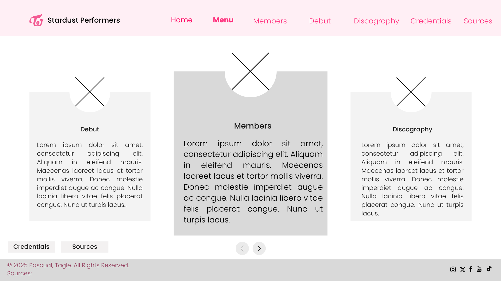
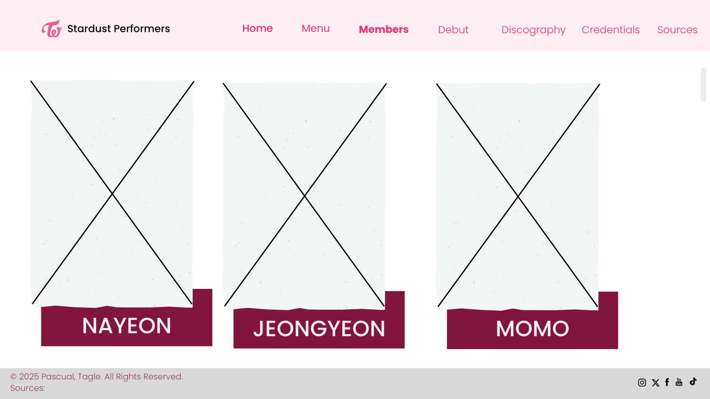
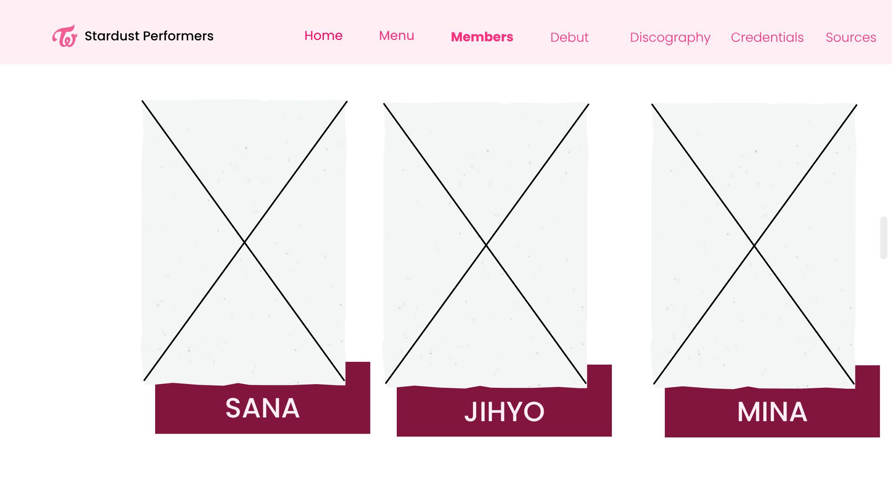
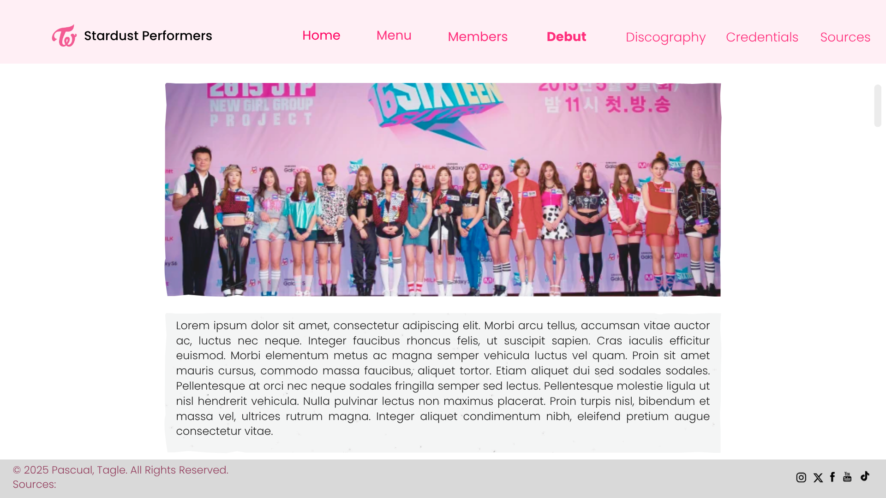
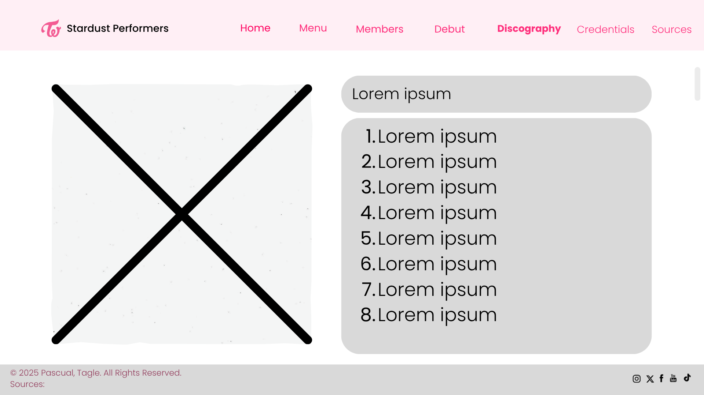
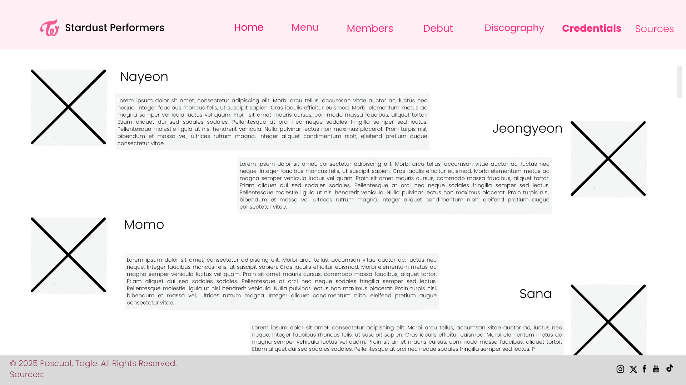

# Pascual and Tagle 9-Rb Project Proposal
## Stardust Performers
### Second Title: One In A Million: After 10 Years
******
#### Logo:
#### 
#### File:Twice, logo, Kpop, Pink, Purple PNG image with transparent - KPop Twice Logo PNG, PNG download(708x644) - PngFind. (n.d.). PngFind.com. https://www.pngfind.com/mpng/TRmRxwm_twice-logo-kpop-pink-purple-png-image-with/
### Description
### This website serves as a guide for new ONCEs who are interested in getting to know the girls better. After 10 years together, one can easily follow their journey as a nine-member girl group through this website. Additionally, it showcases their artistry and identity as a group through their music. TWICE’s talents should never go unnoticed—their ability to compose, write, and produce their own songs is truly remarkable. This website stands as an honor to them, celebrating their achievement of lasting 10 years as a nine-member group, filled with passion and love for what they do.
******
### Webpage Breakdown:
### Home: This will contain a description of the website with a picture/logo of TWICE that will act as a button as a link to the sub homepage.	
### Menu: This will contain all of the menus that will serve as an introduction to the girls.
### Members: This page will briefly introduce the members individually.
### Debut: This page will briefly discuss how the members were gathered and how TWICE was formed.
### Discography: This page will showcase the music that they have put out through the years (Only Korean discography).
### Credentials: This will contain the KOMCA song credits of each member.
### Sources: This will contain all of the sources that we’ve used while making the website.
******
### Description of usage of JavaScript:
### Navigation Bar for Members: The member images in the will respond to clicks or hover effects using JavaScript. For example, when you hover over a member, their name and short description can appear dynamically.
### Image/Content Sliders: JavaScript will make image slideshows or carousels to showcase TWICE’s album covers and group photos.
### Song/Audio Player: JavaScript will be used to play short previews of TWICE’s songs when clicking on an album cover.
### Discography Filters: Users can click buttons to filter albums by category (Full Album, Mini Album, Repackage) or by year. The content will update instantly without reloading the page.
### Footer Year: The copyright year in the footer will automatically update every year using a short JS script.
******
#### Wireframes:
#### Home Page:
#### 
#### Menu:
#### 
#### Members:
#### 
#### 
#### 
#### 
#### Members Expanded:
#### 
#### 
#### 
#### 
#### 
#### 
#### 
#### 
#### 
#### Debut:
#### 
#### Discography:
#### 
#### 
#### 
#### 
#### Discography Expanded:
#### 
#### 
#### 
#### 
#### 
#### 
#### 
#### 
#### 
#### 
#### 
#### 
#### 
#### 
#### 
#### 
#### 
#### 
#### 
#### 
#### 
#### 
#### 
#### 
#### 
#### 
#### 
#### 
#### 
#### 
#### 
#### 
#### 
#### Credentials and Credentials Expanded:
#### 
#### 
#### 
#### 
#### 
#### 
#### Sources:
#### 
#### 
#### 
#### 
#### 
#### 
#### 
#### 
#### 
#### 
